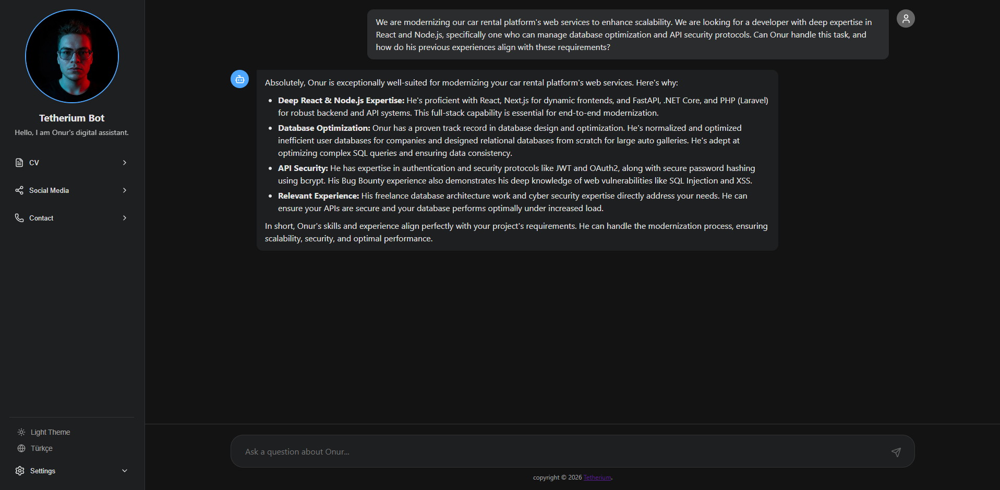
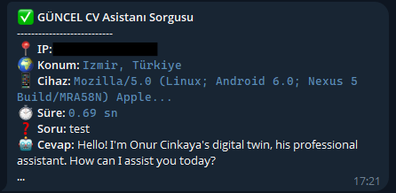

#  Personal AI CV Assistant

An AI-powered personal assistant that answers questions about you — built with **React** (frontend), **FastAPI** (backend), and **Google Gemini** (AI).

Recruiters and visitors can ask anything about your experience, skills, and projects in a natural chat interface.



---

##  Features

-  Chat interface powered by Google Gemini AI
-  English / Turkish language toggle
-  Dark / Light theme toggle
-  CV download links (Turkish & English)
-  Social media & contact section in a collapsible sidebar
-  Optional Telegram logging for each query

---

##  Tech Stack

| Layer | Technology |
|-------|-----------|
| Frontend | React, Vanilla CSS |
| Backend | FastAPI (Python) |
| AI | Google Gemini 2.0 Flash via OpenAI-compatible API |
| Icons | Lucide React |

---

##  Getting Started

### Prerequisites
- Python 3.9+
- Node.js 18+
- A [Google Gemini API key](https://aistudio.google.com/app/apikey)

---

### 1. Clone the repository

```bash
git clone https://github.com/YOUR-USERNAME/personal-cv-assistant.git
cd personal-cv-assistant
```

### 2. Configure environment variables

Copy the example env file and fill in your keys:

```bash
cp .env .env.local
```

Edit `.env`:
```
GEMINI_API_KEY=YOUR_GEMINI_API_KEY_HERE
```

### 3. Add your personal data

Edit **`bilgi.txt`** with your own information:
- Name, title, education
- Technical skills
- Work experience and projects
- Contact info

### 4. Install backend dependencies

```bash
pip install -r requirements.txt
```

### 5. Start the backend

```bash
uvicorn main:app --reload
```

The API will be available at `http://127.0.0.1:8000`.

### 6. Install & start the frontend

```bash
cd frontend
npm install
npm start
```

Open [http://localhost:3000](http://localhost:3000) in your browser.

---

##  Customization

| What | Where |
|------|-------|
| Your info & bio | `bilgi.txt` |
| AI personality & name | `main.py` → `system_prompt` |
| Bot name & labels | `frontend/src/translations.js` |
| Profile photo | `frontend/public/profile.png` |
| CV PDFs | `frontend/public/YOUR_CV_TR.pdf`, `YOUR_CV_EN.pdf` |
| Social & contact links | `frontend/src/components/Sidebar.js` |

---

## 📡 Optional: Telegram Logging

You can receive a Telegram notification for every question asked. To enable:

1. Create a bot via [@BotFather](https://t.me/BotFather) and get your token.
2. Get your Chat ID via [@userinfobot](https://t.me/userinfobot).
3. Fill in `.env`:

4. 
```
TELEGRAM_TOKEN=YOUR_TOKEN
TELEGRAM_CHAT_ID=YOUR_CHAT_ID
```

---

##  Project Structure

```
personal-cv-assistant/
├── bilgi.txt              # Your personal data (AI's knowledge base)
├── main.py                # FastAPI backend
├── requirements.txt       # Python dependencies
├── .env                   # API keys (never commit this)
└── frontend/
    ├── public/
    │   ├── profile.png    # Your profile photo
    │   └── *.pdf          # Your CV files
    └── src/
        ├── App.js
        ├── translations.js
        └── components/
            ├── Sidebar.js
            └── ChatArea.js
```

---

## 📄 License

MIT License — feel free to fork and adapt for your own use.
